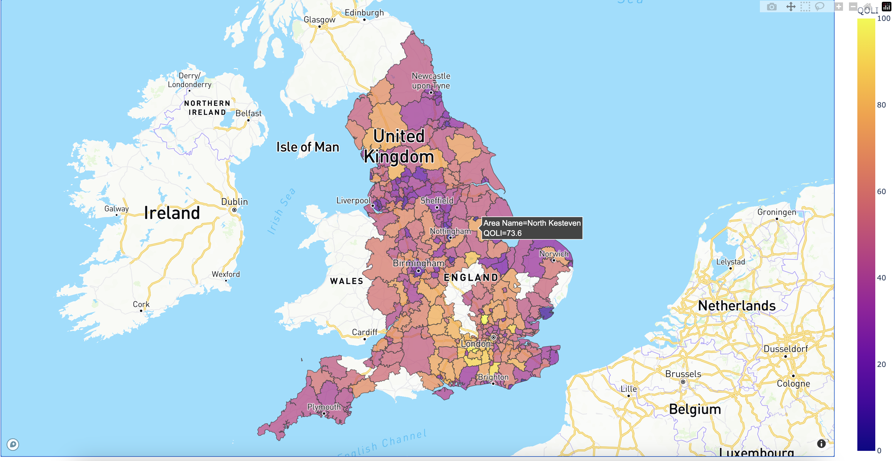
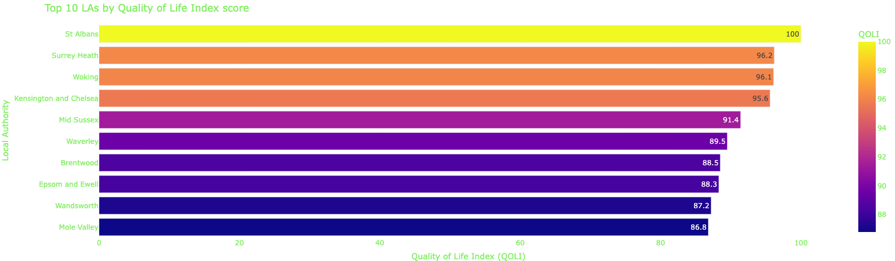
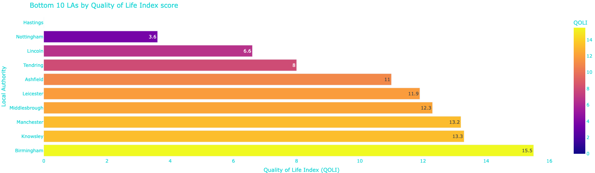

## Quality of Life Index - England Councils

### Overview

Using `Probabilistic Principal Component Analysis (PPCA)` from socioeconomic indicators relating to "Quality of Life", I created the Quality of Life Index (QOLI) ranking each 
Local Authority from 0-100. The findings are displayed in an [interactive map](https://quality-of-life-index-england.netlify.app/) (Please do click the link).  

The variables used in index construction:
- i_1: Economic inactivity rate
- i_5: Modelled unemployment rate
- i_6: Gross disposable household income
- i_7: Gross median weekly pay
- i_23: GCSEs in English and Maths
- i_53: Anxiety
- i_55: Happiness
- i_56: Life satisfaction  

The top and bottom QOLI rankings are summarised below:

  
  

Full step-by-step methodology given in [QOLI_notebook.ipynb](https://github.com/arashid9-1/QOLI/blob/master/QOLI_notebook.ipynb)

### Data
