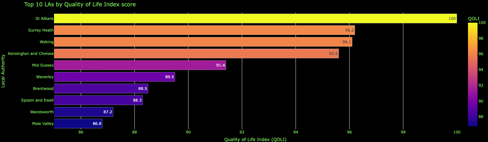
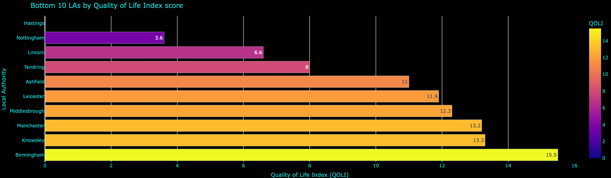

# Quality of Life Index - England Local Authority Districts 

## Overview

The Quality of Life Index (QOLI) was constructed using Probabilistic Principal Component Analysis (PPCA) on key socioeconomic indicators. This index ranks each Local Authority in England on a scale from 0 to 100, based on their quality of life. The results are displayed in an [interactive map](https://quality-of-life-index-england.netlify.app/) (Please do click the link :D).  

Indicators Used in Index Construction:
- i_1: Economic inactivity rate
- i_5: Modelled unemployment rate
- i_6: Gross disposable household income
- i_7: Gross median weekly pay
- i_23: GCSEs in English and Maths
- i_53: Anxiety
- i_55: Happiness
- i_56: Life satisfaction  

### The top and bottom QOLI rankings:

  
  

For a detailed step-by-step methodology, refer to the [QOLI_notebook.ipynb](https://github.com/arashid9-1/QOLI/blob/master/QOLI_notebook.ipynb)  

## Data Sources and Libraries

All indicator data was obtained from [ONS' Local Statistics Databank](https://explore-local-statistics.beta.ons.gov.uk/). The raw download and cleaned versions of the data can be found in [datadown.ods](https://github.com/arashid9-1/QOLI/blob/master/datadownload.ods) and [cleaned_merged_geodtab.csv](https://github.com/arashid9-1/QOLI/blob/master/cleaned_merged_geodtab.csv)

The geometry data mapping the MultiPoligon boundries for each LA District was created by [Martin JC](https://martinjc.github.io/UK-GeoJSON/).   

All the standard `Python` libraries were used: `Scikit-learn` for the PPCA proccess, `Pandas` and `Geopandas` for data manipulation and `plotly.express` for the visualisations. 

## Methodology 

### PPCA and the EM Algorithm

Principal Component Analysis (PCA) is a multivariate technique used to reduce the dimensionality of data while minimising the loss of variance, allowing us to isolate the underlying common component within a set of variables. In this case, the common component represents "life satisfaction" or "quality of life." PCA works by performing eigenvalue decomposition on the correlation matrix of the variables, identifying the principal components, where each eigenvalue indicates the direction of maximum variance in the data [Chen et al. 2021](https://www.sciencedirect.com/science/article/abs/pii/S1059056021000277) .  

There is however an issue on how to deal with missing values. Dropping an entire LA District for lacking the data for one indicator was not ideal, nor was incurring unwanted noise or bias from using mean or median imputation. This is where Probabilistic Principal Component Analysis (PPCA) comes into play. PPCA extends traditional PCA by assuming that the observed data comes from a latent variable model, where missing values can be estimated probabilistically [Tipiing & Bishop, 1999](https://academic.oup.com/jrsssb/article/61/3/611/7083217). To handle the missing data, PPCA uses the Expectation-Maximisation (EM) algorithm, which iteratively imputes the missing values. This iterative process continues until convergence, ensuring that the imputed values best fit the underlying structure (using Maximum Likelihood) of the data without introducing unnecessary noise, thus allowing for a more accurate calculation of the principal components and, ultimately, the Quality of Life Index (QOLI).  

### QOLI Construction 

After normalising the data and running the PPCA pipeline, the first three principal components explained the majority of the variance in the dataset. Examining the eigenvectors (factor loadings) of these components, it became apparent that Principal Component 1 (PC1) captured the commonality related to Quality of Life (QOL) across the socioeconomic indicators.  

|      | PC1   | PC2   | PC3   |
|------|-------|-------|-------|
| i_1  | -0.33 |  0.14 |  0.56 |
| i_5  | -0.32 | -0.13 |  0.60 |
| i_6  |  0.37 | -0.34 |  0.41 |
| i_7  |  0.43 | -0.35 |  0.24 |
| i_23 |  0.48 | -0.17 |  0.06 |
| i_53 | -0.15 | -0.49 | -0.27 |
| i_55 |  0.27 |  0.51 |  0.16 |
| i_56 |  0.36 |  0.44 |  0.04 |

 
#### PC1 Factor Loadings

- Economic Inactivity rate (-0.33)
- Unemployment rate (-0.31)
- Weekly Income (+0.37)
- Disposable Income (+0.43)
- GCSEs in Maths and English (+0.48)
- Anxiety (-0.15)
- Happiness (+0.27)
- Life Satisfaction (+0.36)   

FInaly, the index was rescaled to range from 0 to 100. 

